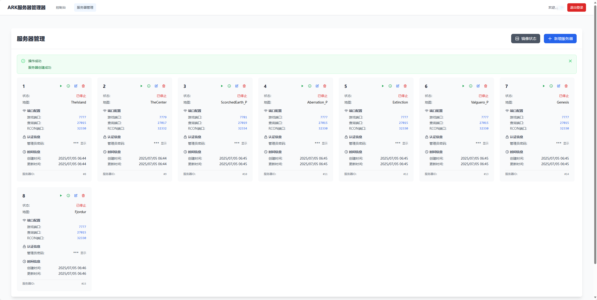
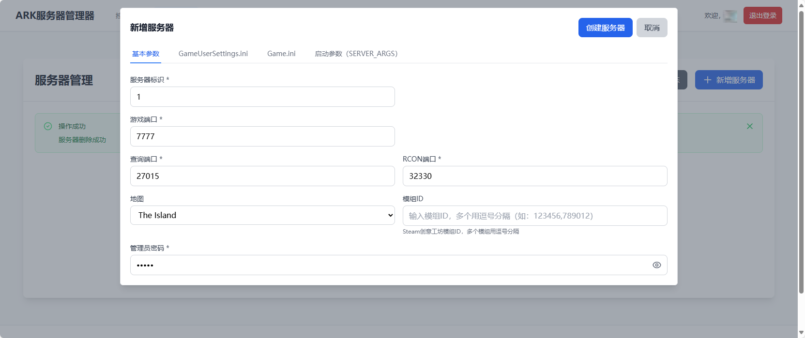
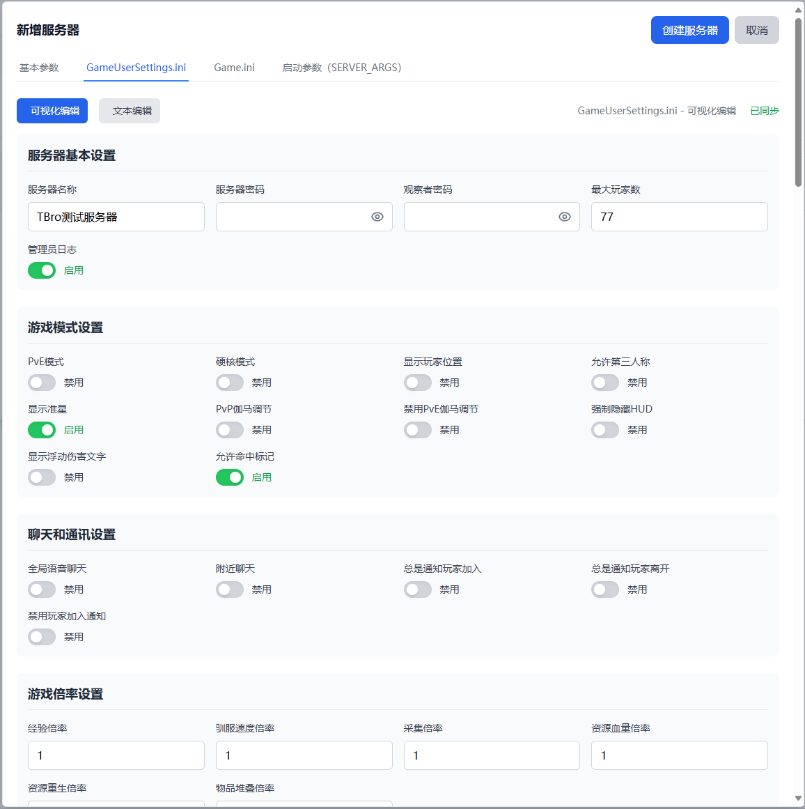
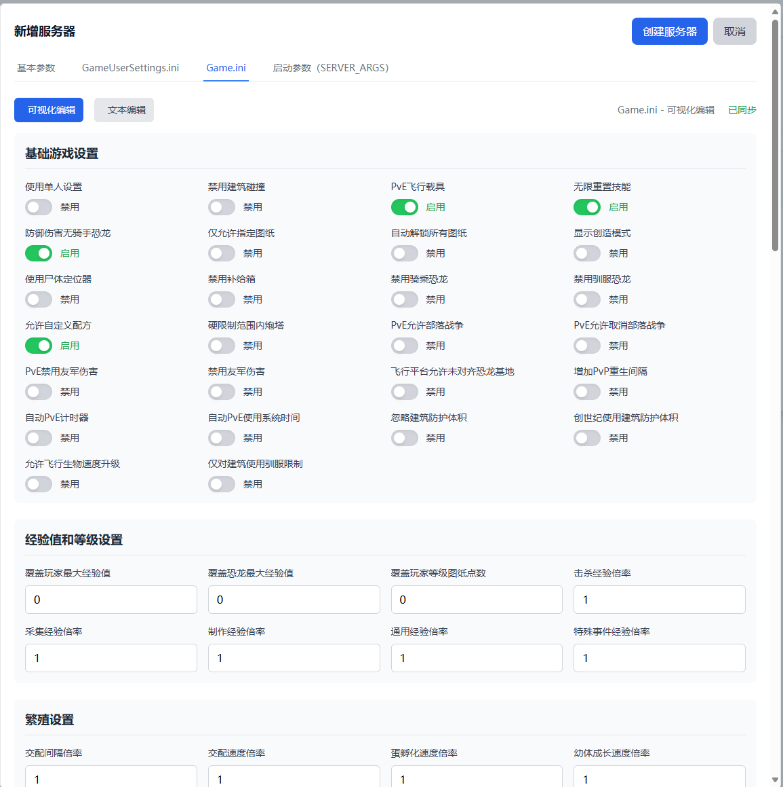
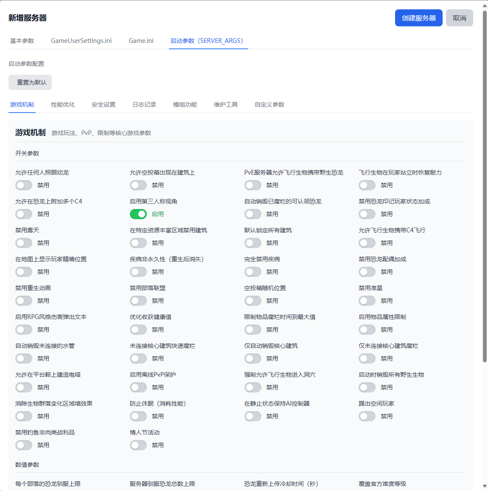

# ARK 服务器管理器

> ⚠️ **开发阶段提示**：本项目目前仍处于开发阶段，功能可能不完整或存在稳定性问题。建议仅用于测试环境，不建议在生产环境中使用。

[English](README.md) | [Português (pt-BR)](README-pt-BR.md) | **中文**

- Linux上的 ARK 生存进化服务器管理工具。
- ARK 服务器自带 ArkApi 插件系统。

## 🎮 功能特性

### ✅ 已实现功能
- 🐳 每个ARK服务器运行在独立的Docker容器中
- 🔌 服务器自带ArkApi
- 🔄 服务器容器支持崩溃自动重启
- ⬆️ 第一次启动时自动更新服务端文件和Mod
- 💾 自动创建和管理Docker卷存储游戏数据
- 🖥️ 添加和管理多个 ARK 服务器
- ⚙️ 配置服务器设置和配置参数（GameUserSettings.ini、Game.ini、启动参数）
- ▶️ 一键启动/停止/重启服务器
- 🖼️ Docker镜像管理（拉取、更新、状态检查）
- 🔐 JWT认证和用户管理
- 📝 完整的API文档（Swagger）
- 🧩 **插件管理器** — 文件浏览器，支持拖拽上传、重命名、删除、创建文件夹
- 📝 **JSON/INI/配置文件编辑器** — 内联模态编辑器，支持 `.json`、`.ini`、`.txt`、`.cfg`、`.yaml`、`.xml`、`.conf`
- 📦 **Zip/Unzip** — 上传自动解压、手动解压、文件夹下载为ZIP
- 📋 **配置导入/导出** — 一键导入导出所有配置（GameUserSettings.ini + Game.ini + server_args）为单个JSON文件；每页标签页支持单独下载/导入
- 🌐 **i18n 国际化** — 英文（en）、中文（zh）和葡萄牙语（pt-BR），默认英文，语言选择保存在 `NEXT_LOCALE` Cookie 中

### 🚧 待实现功能
- 🎮 RCON 命令执行
- 📊 服务器运行状态监控
- 🎨 Mod管理对接steam创意工坊
- 📋 服务器日志查看
- 💾 服务器存档及配置备份
- 🔍 工具版本更新检查
- ⚡ 可选更新服务端文件和Mod
- 🔄 容器镜像更新功能
- 🔌 MCP 支持
   
### 🚀 未来计划
- ☸️ 多主机管理，可能基于K8S实现
- 🌍 服务器收录网站，脱离糟糕的steam搜服
- 👥 玩家使用界面

## 🔒 安全提示

### ⚠️ JWT密钥配置（重要）

**在部署此应用程序之前，您必须配置一个强JWT密钥！**

#### 为什么这很重要？
- JWT（JSON Web Token）用于用户认证和会话管理
- 弱密钥或默认密钥允许攻击者伪造认证令牌
- 这可能导致**系统完全被攻破**和对所有服务器的未授权访问

#### 如何配置：

**1. 生成强随机密钥（推荐）：**
```bash
openssl rand -base64 48
```

**2. 设置环境变量：**

对于 Docker Compose 部署，从模板创建 `.env` 并填入密钥（`docker-compose.yml`
通过 `env_file` 读取它）：
```bash
cp .env.example .env
# 编辑 .env：JWT_SECRET=<上一步生成的密钥>
```

不要把密钥直接写进 `docker-compose.yml`——那会被提交进版本控制。
`.env` 已在 `.gitignore` 中，`.env.example` 才是被跟踪的模板。

对于直接部署：
```bash
export JWT_SECRET="$(openssl rand -base64 48)"
```

#### 安全要求：
- ✅ 最小长度：32 字符
- ✅ 使用加密随机生成
- ✅ 永远不要将密钥提交到版本控制
- ✅ 不同环境使用不同密钥（开发/测试/生产）
- ❌ 永远不要使用默认值如 "your-secret-key-here"（其中含有 "secret"，会被直接拒绝）
- ❌ 永远不要使用常见密码或字典单词

#### 验证：
应用程序将**拒绝启动**如果：
- JWT_SECRET 未设置
- JWT_SECRET 短于 32 字符
- JWT_SECRET 包含弱/常见密码模式：`ark-server-commander-secret-key`、`secret`、
  `password`、`123456`、`default`、`changeme`、`test`
  （不区分大小写的**子串**匹配，因此 `my-secret-key-...` 会被拒绝）

轮换该密钥会使所有已签发的 access token 和 refresh token 立即失效，用户需要重新登录。

---

## 🚀 快速开始

### 🔧 系统要求

- 每个ARK服务器 8GB+ 内存 (推荐)
- 每个ARK服务器 10GB+ 磁盘空间

### 🔧 本地开发（Docker）

构建包含 Go 后端和 Next.js 前端的自定义镜像：
```bash
# 1. 克隆
git clone https://github.com/21oramaster/ark-commander.git
cd ark-commander

# 2. 从模板创建 .env
cp .env.example .env

# 3. 生成 JWT 密钥并写入 .env
openssl rand -base64 48
# 编辑 .env，设置 JWT_SECRET=<刚生成的值>

# 4. 容器以非 root 用户运行，需要宿主机 docker 组的 GID 才能访问 Docker socket
echo "DOCKER_GID=$(stat -c '%g' /var/run/docker.sock)" >> .env

# 5. 启动
docker compose up -d
```

访问地址：`http://<your-ip>:3000`（Web 界面）、`http://<your-ip>:8080`（API + Swagger）。
首次访问会跳转到初始化页面，由您自行设置管理员账号和密码。

> ⚠️ **没有 `JWT_SECRET` 后端不会启动。** 长度至少 32 字符，且不能包含弱口令模式
> （`secret`、`password`、`123456`、`default`、`changeme`、`test` 等）。
> 如果容器反复重启，`docker compose logs` 会明确指出违反了哪一条规则。

### 🧰 构建工具链

镜像为三阶段构建，顺序如下：

**阶段 1 — Go（`golang:1.24.4-alpine`）** 编译 API 二进制
→ **阶段 2 — Node（`node:20.19.0-alpine`）** 编译 Next.js standalone 产物
→ **阶段 3 — `alpine:3.22`** 运行时，安装 `nodejs` 和 `tini`，并以非 root 用户
`arkcommander` 运行两个进程。

| 工具链 | 版本 | 定义位置 |
|--------|------|----------|
| Go（镜像构建） | 1.24.4 | `Dockerfile` 阶段 1 |
| Go（CI） | 1.24 | `.github/workflows/ci.yml` |
| Node（镜像构建） | 20.19.0 | `Dockerfile` 阶段 2 |
| Node（CI） | 22 | `.github/workflows/ci.yml` |
| Node（运行时） | 22.x，来自 Alpine 3.22 的 `nodejs` 包 | `Dockerfile` 阶段 3 |

所有基础镜像都固定到精确的补丁版本标签，避免同一个 commit 的两次构建之间
运行时操作系统（以及 `apk` 安装的 Node 主版本）发生漂移。

前端由 Node 20 **编译**、在 Node 22 上**运行**，CI 也在 Node 22 上验证，
因此本地开发所需的最低版本是 **Node 20**。

### ⚙️ 环境变量

所有配置都通过环境变量读取。使用 Docker Compose 时来自 `.env`（`env_file`），
带注释的模板见 [`.env.example`](.env.example)。

| 变量 | 必填 | 默认值 | 说明 |
|------|------|--------|------|
| `JWT_SECRET` | **是** | — | JWT 签名密钥。至少 32 字符，包含弱口令模式会被拒绝。缺失或非法时进程直接退出。用 `openssl rand -base64 48` 生成。 |
| `SERVER_PORT` | 否 | `8080` | Go API 监听端口。纯数字，不带冒号。 |
| `DB_PATH` | 否 | `ark_server.db` | SQLite 数据库文件。Dockerfile 覆盖为 `/data/ark-commander.db`，docker-compose 将其映射到 `./data`。 |
| `CORS_ORIGIN` | 否 | *(空)* | 允许跨域调用 API 的精确来源列表，逗号分隔。空表示仅同源，完全不输出 `Access-Control-Allow-Origin`。**不再支持 `*`。** |
| `TRUSTED_PROXIES` | 否 | *(空)* | 可信任其 `X-Forwarded-For` 的 IP/CIDR，逗号分隔。空表示谁都不信任，客户端 IP 取自真实 socket 地址，无法伪造。 |
| `LOG_LEVEL` | 否 | `info` | `debug`、`info`、`warn`、`error`、`panic` 或 `fatal`。无法识别的值回退为 `info`。 |
| `LOG_FORMAT` | 否 | `json` | `json`（结构化，供日志采集）或 `console`（彩色，便于阅读）。 |
| `PORT` | 否 | `3000` | Next.js standalone 服务监听端口。 |
| `HOSTNAME` | 否 | `0.0.0.0` | Next.js 监听的网络接口。Dockerfile 中固定该值，因为 Docker 会把 `HOSTNAME` 预设为容器 ID。 |
| `SHUTDOWN_GRACE_SECONDS` | 否 | `8` | 收到 SIGTERM 后 `entrypoint.sh` 等待子进程退出的秒数，超时则发送 SIGKILL。需小于 compose 的 `stop_grace_period`（10 秒）。 |

下面两项只在**构建期**生效，写进 `.env` 当作运行时变量是无效的：

| 构建参数 | 默认值 | 说明 |
|----------|--------|------|
| `DOCKER_GID` | `999` | 非 root 运行用户需要加入的宿主机 `docker` 组 GID，用于打开 Docker socket。`docker-compose.yml` 通过 `${DOCKER_GID:-999}` 转发，所以写在 `.env` 里*确实*会传到构建。 |
| `NEXT_PUBLIC_API_BASE` | `http://localhost:8080/api` | Next.js route handler 访问 Go API 的地址。`next build` 会把 `NEXT_PUBLIC_*` 的值内联进编译产物，因此运行时的 `ENV` 是静默无效的。请使用 `docker build --build-arg NEXT_PUBLIC_API_BASE=…`（或 compose 的 `build.args`）。仅在 API 与 UI 分容器部署时需要修改。 |

### 🐳 Docker容器化部署

使用仓库中的 `docker-compose.yml`，或参考下面的最小配置：
```yml
services:
  ark-commander:
    image: tbro98/arkservercommander:latest
    container_name: ark-commander
    ports:
      - "8080:8080"
      - "3000:3000"
    # 密钥不要写死在 compose 文件里 —— 从 .env 读取
    env_file:
      - .env
    volumes:
      - ./data:/data
      # 应用通过 Docker SDK 管理 ARK 游戏服容器，必须挂载 socket
      - /var/run/docker.sock:/var/run/docker.sock:ro
    restart: unless-stopped
```

> ⚠️ 旧版文档中的 `privileged: true` **已被移除**，请不要再加回去：
> 挂载 Docker socket 已经足够，特权模式只会额外扩大攻击面。

```bash
sudo docker compose up -d
```

### 🔀 重要变更（升级已有部署时请注意）

1. **`GET /api/servers` 和 `GET /api/servers/:id` 不再返回 `admin_password`。**
   该字段已从响应中移除，避免每次列表请求都泄露 RCON 凭据。请改用专用接口
   `GET /api/servers/:id/rcon`。

2. **`CORS_ORIGIN` 的默认值不再是 `*`。** 现在默认为空 —— 仅同源，且完全不输出
   `Access-Control-Allow-Origin`；取值是逗号分隔的精确来源白名单，不支持通配符。
   原本隐式可用的跨域客户端会被拦截，直到把它的来源加入白名单。

3. **`TRUSTED_PROXIES` 默认不信任任何代理。** Gin 不再采信任何来源的
   `X-Forwarded-For`，审计日志 IP 和限流都使用真实 socket 地址。若前面有反向
   代理，请将其 IP/CIDR 配置到 `TRUSTED_PROXIES`，否则所有请求看起来都来自该代理。

## 📖 使用说明

### 🆕 首次使用
1. 系统会自动跳转到初始化页面
2. 设置您的管理员账号和密码
3. 初始化完成后登录系统

### 🖥️ 管理服务器
1. 登录后点击"服务器管理"
2. 点击"添加服务器"创建新的服务器配置
3. 点击铅笔图标编辑服务器 — 在4个标签页中配置基本参数、GameUserSettings.ini、Game.ini 和启动参数

### 🧩 插件管理器
1. 在侧边栏导航到"插件管理"
2. 选择服务器，然后浏览、上传、编辑、重命名、删除或下载插件文件
3. ZIP文件上传时自动解压；使用解压按钮手动解压已有ZIP
4. 使用"下载为ZIP"按钮下载文件夹

### 📋 配置导入/导出
1. 打开服务器的编辑页面
2. 使用"导出所有配置"将所有设置下载为JSON
3. 使用"导入所有配置"从之前导出的JSON恢复
4. 每个标签页有单独的下载/导入按钮用于单文件操作

### 🗺️ 支持的地图
- The Island (孤岛)、The Center (中心岛)、Scorched Earth (焦土)
- Aberration (畸变)、Extinction (灭绝)、Valguero (瓦尔盖罗)
- Genesis (创世纪)、Genesis 2 (创世纪2)、Crystal Isles (水晶岛)
- Lost Island (失落岛)、Fjordur (峡湾)

## ❓ 常见问题

### ❓ Q: 如何备份ARK服务器数据？
A: 服务器数据存储在Docker卷 `ark-server-<服务器编号>` 中。可以手动备份，或使用导出配置功能备份设置。

### ❓ Q: 如何查看ARK服务器日志？
A: 目前需要在容器内查看日志。日志查看功能计划在后续更新中实现。

### ❓ Q: 如何更新ARK服务器镜像？
A: 转到首页，点击服务器卡片上的"检查更新"。系统会比较本地和远程镜像摘要并提示更新。

### ❓ Q: JWT_SECRET 配置错误怎么办？
A: 如果应用启动失败并提示 JWT_SECRET 错误，请确保：
- JWT_SECRET 已在环境变量中设置
- 密钥长度至少 32 字符
- 使用 `openssl rand -base64 48` 生成强随机密钥


### 🖼️ ARK服务器镜像
- 本系统使用 `tbro98/ase-server:latest` 镜像来运行ARK服务器
- 镜像源地址: [ASE-Server-Docker](https://github.com/tbro199803/ASE-Server-Docker)

## 📸 界面展示






## 📚 更多文档

- [CHANGELOG.md](CHANGELOG.md) — 版本历史
- [CONTRIBUTING.md](CONTRIBUTING.md) — 贡献指南
- [SECURITY.md](SECURITY.md) — 漏洞报告与安全加固说明
- [CODE_OF_CONDUCT.md](CODE_OF_CONDUCT.md) — 行为准则

## 🌐 其他语言

- [English](README.md)
- [Português (pt-BR)](README-pt-BR.md)

